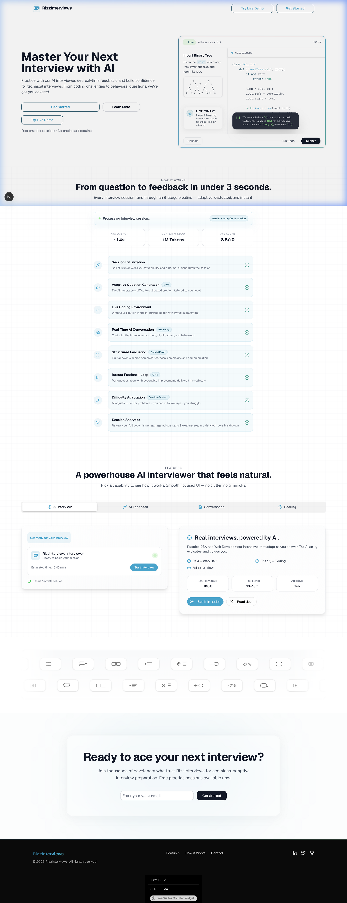
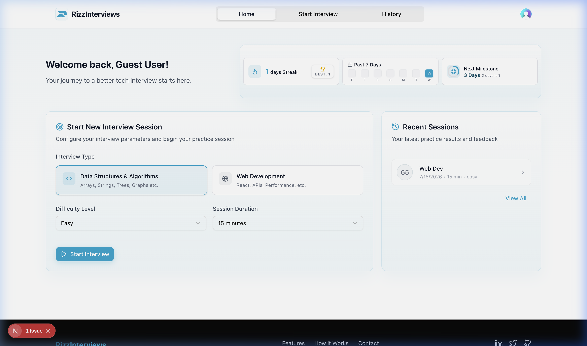
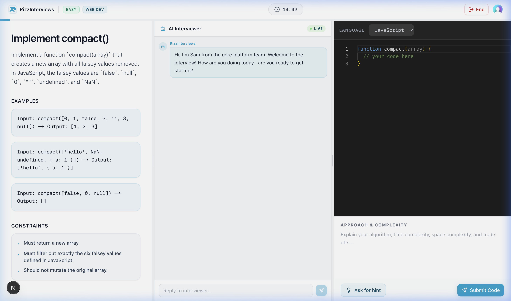
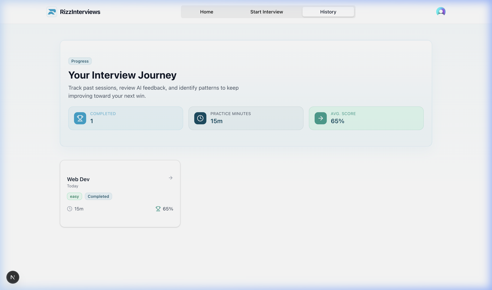
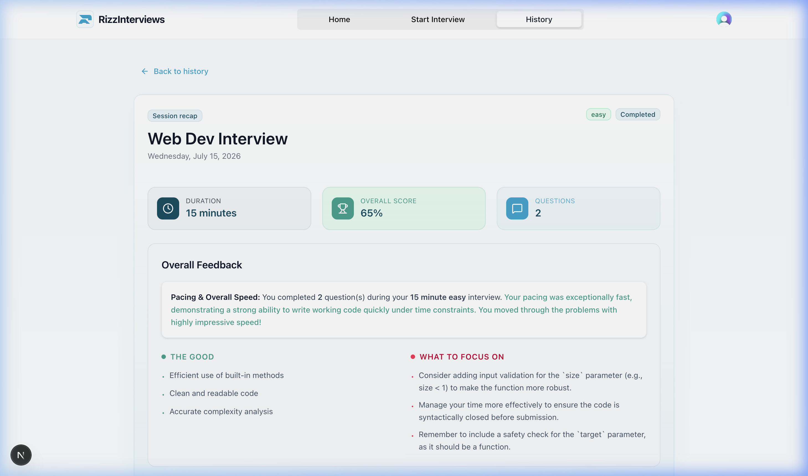

<div align="center">
  
  <h1>RizzInterviews</h1>
  <p>AI-driven technical interview practice that actually talks back.</p>
  
  <p>
    <a href="https://www.rizzinterviews.in"><strong>Live Demo</strong></a> ·
    <a href="#quickstart"><strong>Quickstart</strong></a> ·
    <a href="#features"><strong>Features</strong></a>
  </p>
  
  <p>
    
    
    
    
    
  </p>
</div>

<br/>



## Overview

I built RizzInterviews because grinding static LeetCode problems doesn't prepare you for the back-and-forth dialogue of a real software engineering interview. 

Instead of just checking your code against test cases, RizzInterviews drops you into a live editor and uses LLMs (Gemini/Groq) to simulate the interviewer. It asks follow-up questions, provides hints when you're stuck, and pushes back on your implementation choices.

<div align="center">
  
  
</div>
<br/>
<div align="center">
  
  
</div>

## Features

- 🤖 **AI Interviewer:** Fast conversational feedback using Gemini and Groq.
- 💻 **Live Code Canvas:** Built-in Monaco editor so you can code directly in the browser.
- 🔥 **Streak Tracking:** Keep yourself accountable with daily practice metrics.
- 🔒 **Auth:** Handled natively by Clerk.
- ⚡ **UI:** Built with Tailwind CSS v4 and Framer Motion.

## Tech Stack

- **Framework:** [Next.js 15 (App Router)](https://nextjs.org) + [React 19](https://react.dev/)
- **Database:** [Neon PostgreSQL](https://neon.tech/) (Serverless) + [Drizzle ORM](https://orm.drizzle.team/)
- **Authentication:** [Clerk](https://clerk.com/)
- **AI Integration:** [Google GenAI](https://ai.google.dev/) + [Groq SDK](https://groq.com/)
- **Rate Limiting:** [Upstash Redis](https://upstash.com/)

---

## Quickstart

### Prerequisites
- Node.js 18.x or later
- [pnpm](https://pnpm.io/)
- A PostgreSQL database URL (e.g., from Neon or Supabase)
- API keys for Clerk, Google Gemini, and Groq

### 1. Clone the repository
```bash
git clone https://github.com/your-username/rizzinterviews.git
cd rizzinterviews/nexus-ai-frontend
```

### 2. Install dependencies
```bash
pnpm install
```

### 3. Environment Variables
Copy `.env.example` to `.env`:
```bash
cp .env.example .env
```
Fill in the required keys (Database URL, Clerk Keys, API Keys).

### 4. Setup the Database
Push the schema to your Postgres database:
```bash
pnpm db:push
```

### 5. Run the Development Server
```bash
pnpm dev
```
Open [http://localhost:3000](http://localhost:3000) in your browser.

---

## Deployment

Deploying to Vercel is the easiest route.

[](https://vercel.com/new/clone?repository-url=https%3A%2F%2Fgithub.com%2Fyour-username%2Frizzinterviews)

**Webhooks:** 
Don't forget to set up your Clerk webhooks after you deploy. Point them to your production domain (like `https://www.rizzinterviews.in/api/webhooks`) so user accounts sync properly with Postgres.

## License
MIT License
