<div align="center">
  
  <h1>RizzInterviews</h1>
  <p>AI-driven technical interview practice that actually talks back.</p>
  
  <p>
    <a href="https://www.rizzinterviews.in"><strong>Live Demo</strong></a> ·
    <a href="#quickstart"><strong>Quickstart</strong></a> ·
    <a href="#features"><strong>Features</strong></a>
  </p>
  
  <p>
    
    
    
    
    
    
    
    
    
    
    
    
    
  </p>
</div>

<br/>


## Overview

I built RizzInterviews because grinding static LeetCode problems doesn't prepare you for the back-and-forth dialogue of a real software engineering interview. 

Instead of just checking your code against test cases, RizzInterviews drops you into a live editor and uses LLMs (Gemini/Groq) to simulate the interviewer. It asks follow-up questions, provides hints when you're stuck, and pushes back on your implementation choices.

<div align="center">
  
  
</div>
<br/>
<div align="center">
  
  
</div>

## Features

- 🤖 **AI Interviewer:** Fast conversational feedback using Gemini and Groq.
- 💻 **Live Code Canvas:** Built-in Monaco editor so you can code directly in the browser.
- 🔥 **Streak Tracking:** Keep yourself accountable with daily practice metrics.
- 🔒 **Auth:** Handled natively by Clerk.
- ⚡ **UI:** Built with Tailwind CSS v4 and Framer Motion.

## Architecture

```mermaid
flowchart TD

subgraph group_ui["Web UI"]
  node_landing["Landing page<br/>Next.js page<br/>[page.tsx]"]
  node_practice["Role practice page<br/>Next.js page<br/>[page.tsx]"]
  node_auth["Auth route<br/>Next.js page<br/>[page.tsx]"]
  node_middleware{{"Auth middleware<br/>Next.js middleware<br/>[middleware.ts]"}}
  node_interview_page["Interview session page<br/>Next.js page<br/>[page.tsx]"]
  node_interview_canvas["Interview canvas<br/>React component"]
  node_dashboard_page["Dashboard<br/>Next.js page<br/>[page.tsx]"]
  node_history_page["History views<br/>Next.js pages<br/>[page.tsx]"]
end

subgraph group_api["Server APIs"]
  node_interviews_api["Interview lifecycle API<br/>Route handlers<br/>[route.ts]"]
  node_dashboard_api["Dashboard API<br/>Route handler<br/>[route.ts]"]
  node_history_api["History API<br/>Route handlers<br/>[route.ts]"]
  node_demo_login["Demo login API<br/>Route handler<br/>[route.ts]"]
  node_webhook{{"Webhook API<br/>Route handler<br/>[route.ts]"}}
end

subgraph group_services["Interview Services"]
  node_ai_orchestration["AI interview orchestration<br/>AI service<br/>[interview-chat.ts]"]
  node_ai_providers["AI providers<br/>Provider clients<br/>[gemini.ts]"]
  node_session_state[("Interview session state<br/>Redis service<br/>[interview-redis.ts]")]
  node_scoring["Scoring &amp; streaks<br/>Domain service<br/>[scoring.ts]"]
end

subgraph group_data["Data &amp; Content"]
  node_database[("Durable interview data<br/>Drizzle database<br/>[index.ts]")]
  node_role_content["Role SEO content<br/>JSON content<br/>[seo-roles.json]"]
  node_seo["SEO routes<br/>Next.js metadata routes<br/>[robots.ts]"]
end

node_landing -->|"starts practice"| node_practice
node_practice -->|"loads role metadata"| node_role_content
node_practice -->|"creates session"| node_interviews_api
node_middleware -.->|"routes unauthenticated users"| node_auth
node_demo_login -.->|"supports demo access"| node_auth
node_interview_page -->|"renders"| node_interview_canvas
node_interview_canvas -->|"questions, answers, chat, completion"| node_interviews_api
node_interviews_api -->|"orchestrates interview"| node_ai_orchestration
node_ai_orchestration -->|"uses models and fallback"| node_ai_providers
node_interviews_api -->|"reads and updates state"| node_session_state
node_interviews_api -->|"persists sessions"| node_database
node_interviews_api -->|"scores completion"| node_scoring
node_scoring -->|"stores results"| node_database
node_dashboard_page -->|"loads aggregates"| node_dashboard_api
node_dashboard_api -->|"reads active and recent data"| node_database
node_dashboard_api -->|"uses streak aggregates"| node_scoring
node_history_page -->|"loads list and detail"| node_history_api
node_history_api -->|"reads completed sessions"| node_database
node_seo -->|"indexes role pages"| node_role_content

click node_landing "https://github.com/sadique-mohammed/rizz-interviews/blob/main/src/app/page.tsx"
click node_practice "https://github.com/sadique-mohammed/rizz-interviews/blob/main/src/app/practice/%5Brole%5D/page.tsx"
click node_auth "https://github.com/sadique-mohammed/rizz-interviews/blob/main/src/app/auth/%5B%5B...rest%5D%5D/page.tsx"
click node_middleware "https://github.com/sadique-mohammed/rizz-interviews/blob/main/src/middleware.ts"
click node_interview_page "https://github.com/sadique-mohammed/rizz-interviews/blob/main/src/app/interview/%5BsessionId%5D/page.tsx"
click node_interview_canvas "https://github.com/sadique-mohammed/rizz-interviews/blob/main/src/components/interview/interview-canvas.tsx"
click node_dashboard_page "https://github.com/sadique-mohammed/rizz-interviews/blob/main/src/app/(main)/dashboard/page.tsx"
click node_history_page "https://github.com/sadique-mohammed/rizz-interviews/blob/main/src/app/(main)/history/page.tsx"
click node_interviews_api "https://github.com/sadique-mohammed/rizz-interviews/blob/main/src/app/api/interviews/route.ts"
click node_dashboard_api "https://github.com/sadique-mohammed/rizz-interviews/blob/main/src/app/api/dashboard/route.ts"
click node_history_api "https://github.com/sadique-mohammed/rizz-interviews/blob/main/src/app/api/history/route.ts"
click node_demo_login "https://github.com/sadique-mohammed/rizz-interviews/blob/main/src/app/api/demo-login/route.ts"
click node_webhook "https://github.com/sadique-mohammed/rizz-interviews/blob/main/src/app/api/webhooks/route.ts"
click node_ai_orchestration "https://github.com/sadique-mohammed/rizz-interviews/blob/main/src/lib/ai/interview-chat.ts"
click node_ai_providers "https://github.com/sadique-mohammed/rizz-interviews/blob/main/src/lib/ai/gemini.ts"
click node_session_state "https://github.com/sadique-mohammed/rizz-interviews/blob/main/src/lib/interview-redis.ts"
click node_scoring "https://github.com/sadique-mohammed/rizz-interviews/blob/main/src/lib/scoring.ts"
click node_database "https://github.com/sadique-mohammed/rizz-interviews/blob/main/src/db/index.ts"
click node_role_content "https://github.com/sadique-mohammed/rizz-interviews/blob/main/src/data/seo-roles.json"
click node_seo "https://github.com/sadique-mohammed/rizz-interviews/blob/main/src/app/robots.ts"

classDef toneNeutral fill:#f8fafc,stroke:#334155,stroke-width:1.5px,color:#0f172a
classDef toneBlue fill:#dbeafe,stroke:#2563eb,stroke-width:1.5px,color:#172554
classDef toneAmber fill:#fef3c7,stroke:#d97706,stroke-width:1.5px,color:#78350f
classDef toneMint fill:#dcfce7,stroke:#16a34a,stroke-width:1.5px,color:#14532d
classDef toneRose fill:#ffe4e6,stroke:#e11d48,stroke-width:1.5px,color:#881337
classDef toneIndigo fill:#e0e7ff,stroke:#4f46e5,stroke-width:1.5px,color:#312e81
classDef toneTeal fill:#ccfbf1,stroke:#0f766e,stroke-width:1.5px,color:#134e4a
class node_landing,node_practice,node_auth,node_middleware,node_interview_page,node_interview_canvas,node_dashboard_page,node_history_page toneBlue
class node_interviews_api,node_dashboard_api,node_history_api,node_demo_login,node_webhook toneAmber
class node_ai_orchestration,node_ai_providers,node_session_state,node_scoring toneMint
class node_database,node_role_content,node_seo toneRose
```



## Tech Stack

- **Framework:** [Next.js 15 (App Router)](https://nextjs.org) + [React 19](https://react.dev/)
- **Styling & UI:** [Tailwind CSS v4](https://tailwindcss.com/) + [Framer Motion](https://framer.com/motion) + [Radix UI](https://www.radix-ui.com/) + [Lucide Icons](https://lucide.dev/)
- **Database:** [Neon PostgreSQL](https://neon.tech/) (Serverless) + [Drizzle ORM](https://orm.drizzle.team/)
- **Authentication:** [Clerk](https://clerk.com/)
- **AI Integration:** [Google GenAI SDK](https://ai.google.dev/) + [Groq SDK](https://groq.com/)
- **State & Rate Limiting:** [Upstash Redis](https://upstash.com/)
- **Editor:** [Monaco Editor](https://microsoft.github.io/monaco-editor/)
- **Validation:** [Zod](https://zod.dev/)

---

## Quickstart

### Prerequisites

- Node.js 18.x or later
- [pnpm](https://pnpm.io/)
- A PostgreSQL database URL (e.g., from Neon or Supabase)
- API keys for Clerk, Google Gemini, and Groq

### 1. Clone the repository

```bash
git clone https://github.com/sadique-mohammed/Rizz-Interviews.git
cd Rizz-Interviews
```

### 2. Install dependencies

```bash
pnpm install
```

### 3. Environment Variables

Copy `.env.example` to `.env`:

```bash
cp .env.example .env
```

Fill in the required keys (Database URL, Clerk Keys, API Keys).

### 4. Setup the Database

Push the schema to your Postgres database:

```bash
pnpm db:push
```

### 5. Run the Development Server

```bash
pnpm dev
```

Open [http://localhost:3000](http://localhost:3000) in your browser.

---

## Deployment

Deploying to Vercel is the easiest route.

[](https://vercel.com/new/clone?repository-url=https%3A%2F%2Fgithub.com%2Fsadique-mohammed%2FRizz-Interviews)

**Webhooks:**
Don't forget to set up your Clerk webhooks after you deploy. Point them to your production domain (like `https://www.rizzinterviews.in/api/webhooks`) so user accounts sync properly with Postgres.

## Contributing

Contributions, issues, and feature requests are always welcome! Feel free to check the [issues page](https://github.com/sadique-mohammed/Rizz-Interviews/issues) if you want to contribute.

## License

MIT License
